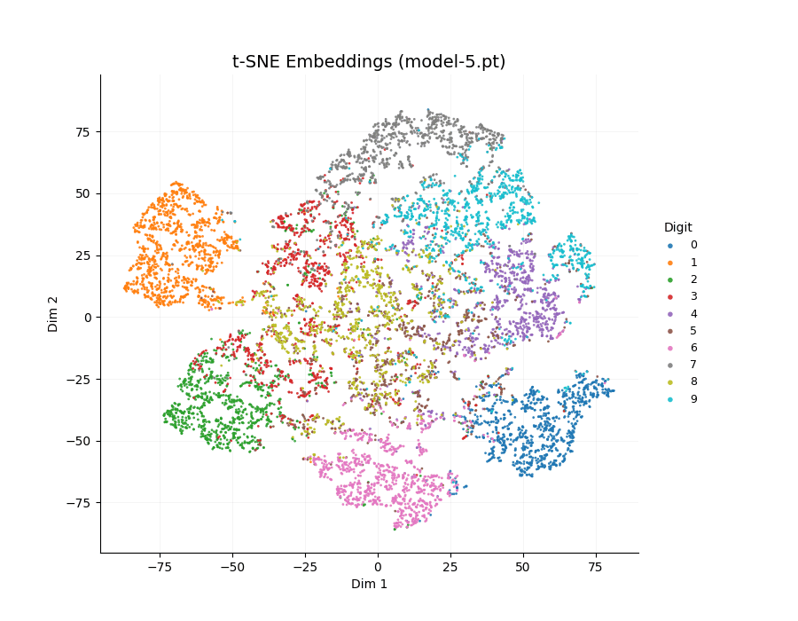
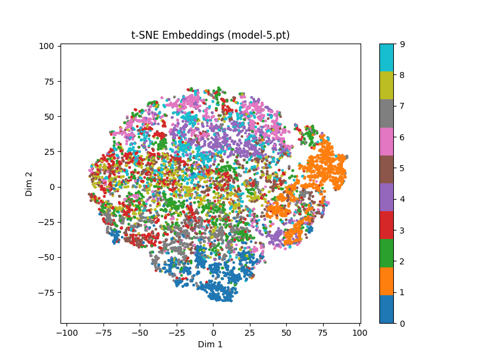
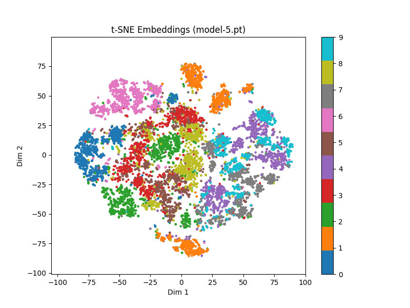
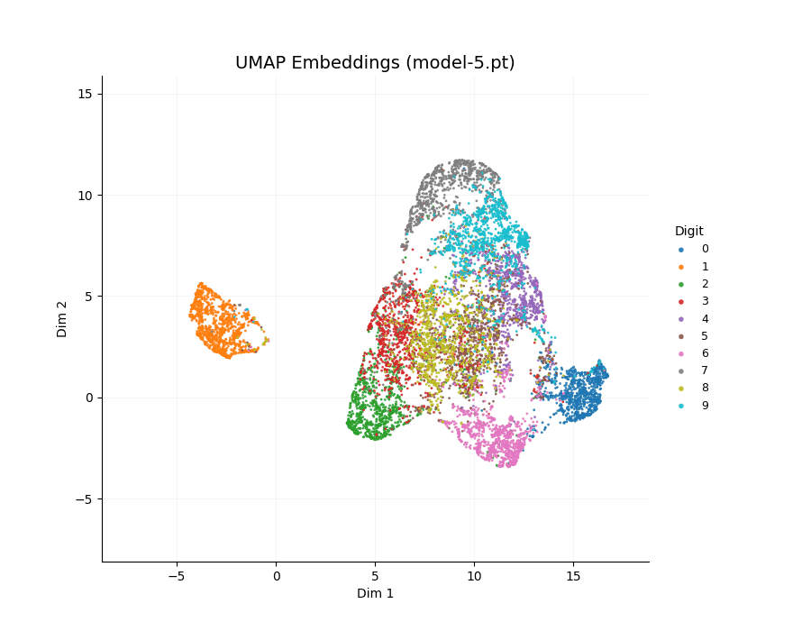
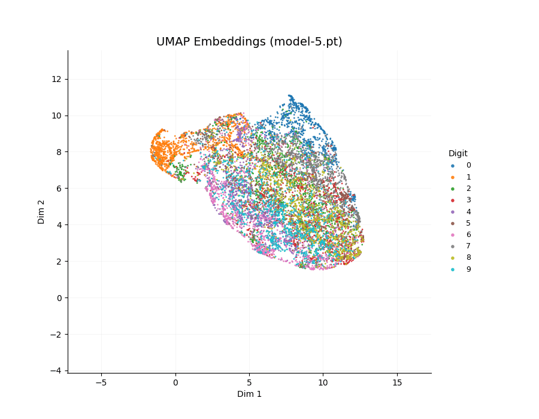
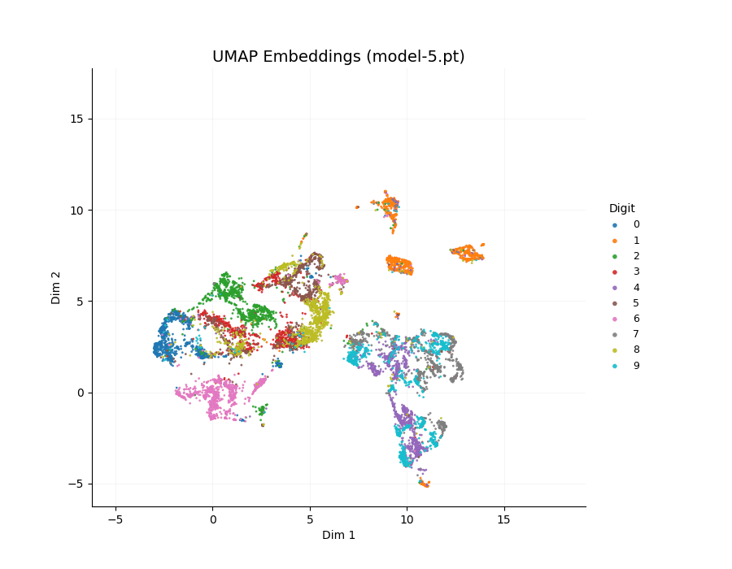

# Energy-Based Model (EBM) with Linear Probing and Vision Transformer

This repository implements **Energy-Based Models (EBMs)** on the **MNIST dataset**, covering:

* Supervised learning
* Self-supervised learning (SSL)
* Vision Transformer (ViT)
* Linear probing for representation evaluation
* Feature space visualization using **t-SNE** and **UMAP**

---

## Overview

Energy-Based Models learn a function that assigns:

* **Low energy** — real (data) samples
* **High energy** — invalid / negative samples

Instead of predicting labels directly, the model learns the **structure of the data distribution**.

This repository explores how representations learned by EBMs evolve under:
* Self-supervised training
* Transformer-based architectures

---

## Project Structure

```
.
├── data/                  # MNIST dataset
├── sup/                   # Supervised training outputs
├── ssl/                   # Self-supervised (CNN)
├── ssl_lp/                # Linear probe on SSL features
├── ssl_vit/               # Self-supervised ViT
├── ssl_vit_lp/            # Linear probe on ViT features
├── modules.py             # Core model components
├── vit.py                 # Vision Transformer implementation
├── tools.py               # Utilities
├── run_model.py           # Main training script
├── loss_plot.py           # Loss visualization
├── tsne_plot.py           # t-SNE visualization
├── umap_plot.py           # UMAP visualization
├── scripts.sh             # Training scripts
└── requirements.txt
```

---

## Model Details

### Energy-Based Model

The model learns an energy function.

Training encourages:

* Lower energy for real samples
* Higher energy for negative samples

This creates a structured **energy landscape** over the data.

---

### Linear Probing

After self-supervised training:

* Encoder is **frozen**
* A **linear classifier** is trained on top

This measures how well the learned features separate classes.

---

### Vision Transformer (ViT)

Implemented in `vit.py`:

* Patch embeddings
* Multi-head self-attention
* Transformer encoder layers

Used to compare representation learning against CNN-based EBMs.

---

## Representation Visualization

The repository tracks how feature representations evolve during training using:

* **t-SNE**
* **UMAP**

Each point represents a data sample, colored by class label.

Over time:

* Clusters become more compact
* Classes become more separable
* Structure emerges in latent space

---

## Visual Results

### t-SNE

<table style="width: 100%; table-layout: fixed;">
  <tr>
    <th>Supervised</th>
    <th>SSL (CNN)</th>
    <th>SSL (ViT)</th>
  </tr>
  <tr>
    <td align="center">
      
    </td>
    <td align="center">
      
    </td>
    <td align="center">
      
    </td>
  </tr>
</table>

---

### UMAP

<table style="width: 100%; table-layout: fixed;">
  <tr>
    <th>Supervised</th>
    <th>SSL (CNN)</th>
    <th>SSL (ViT)</th>
  </tr>
  <tr>
    <td align="center">
      
    </td>
    <td align="center">
      
    </td>
    <td align="center">
      
    </td>
  </tr>
</table>

---

## Outputs

Each experiment produces:

* `loss.csv` → training loss
* `weights/` → model checkpoints
* `.gif` → embedding evolution
* `.png` → final visualization snapshot

---

## Results

<div align="center">

| Method       | Accuracy |
|:------------:|:--------:|
| Supervised   | 94.09%   |
| SSL (CNN)    | 54.53%   |
| SSL (ViT)    | **95.09%**   |

</div>

---

## Summary

This project demonstrates:

* Energy-based representation learning
* Self-supervised feature extraction
* Evaluation via linear probing
* Comparison between CNN and Vision Transformer representations
* Visualization of latent space evolution during training
